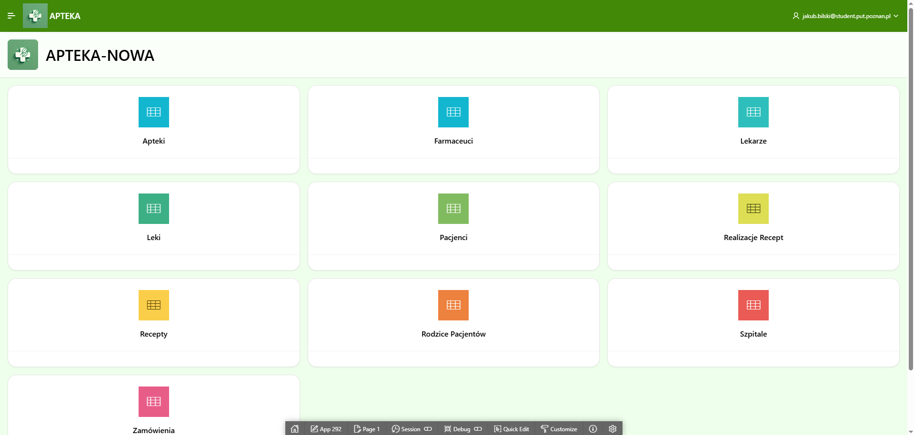
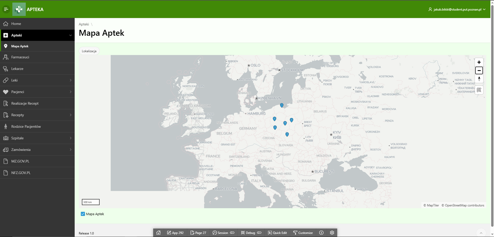
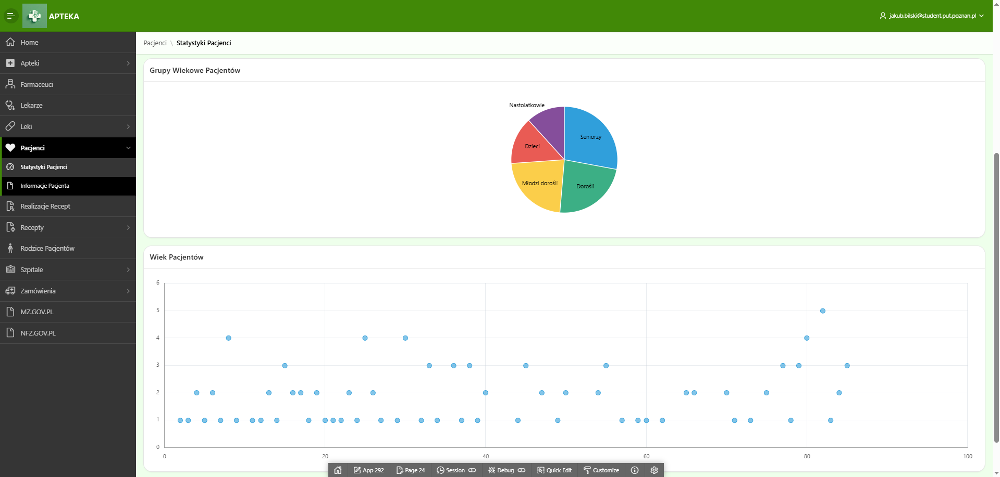
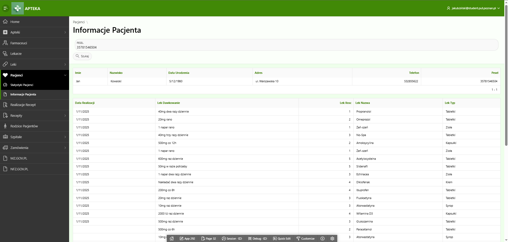
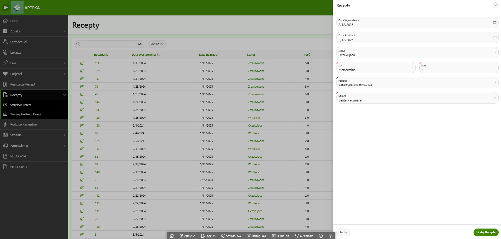
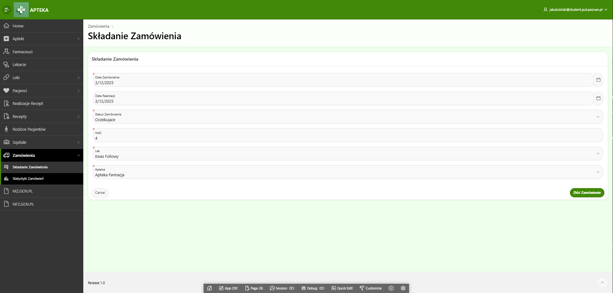
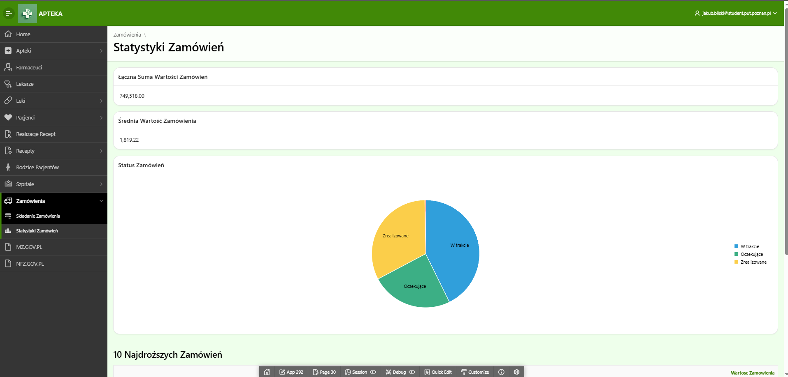

A pharmacy simulation application utilizing SQL was developed for the course "SQL and NoSQL Database Management" at Poznań University of Technology during Semester V of the 2024/2025 academic year.

The application operates from the pharmacist’s perspective, granting access to patient data and an overview of their prescribed medications. It illustrates how the healthcare system functions as an interconnected network of doctors, hospitals, pharmacies, and pharmacists.

Additionally, the application includes data visualization features for pharmaceutical statistics, such as the most frequently prescribed medications. It also incorporates geolocation functionality using JavaScript, displaying the locations of pharmacies on a map.

